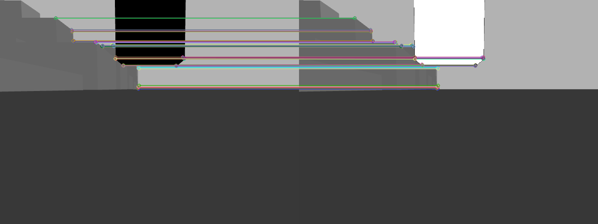

  
  
    

# Landmark Detection and Localization
The landmark detection and localization algorithm accepts a frame, converts the frame to open-cv image format. Then, it tries to extract the features using the ORB feature extractor. Top matches are sent to the reconstruction function where we compute the intrinsic matrix, find the fundamental matrix,
recover the relative camera rotation R matrix and translation T vector, compute the extrinsic matrix, and we finally get the 3d points by multiplying the inverse of the projection matrix with the 2d points.  

The figure below captures the algorithm pseudo-code:  
  

Camera calibration is necessary before determining position of camera relative to a landmark feature. In camera calibration, we try to find the intrinsic and extrinsic matrices. The intrinsic matrix is specific to the camera and is made of the focal length and optical centers.  

Landmark detection and localization was run in ROS in real time. One thing to note here is that we initially wanted to also do simultaneous camera localization but due to a lot of error accumulation and tracking failures due to sudden motion, we instead just substituted the camera location with the (x,y,z) positions from the Ground Truth Pose topic.  

Figures shown below cover few details. In cyan we are depicting the vehicle path. The green dots are the localized landmark features. The orange cube represents the obstacle we generate with the landmark feature point in the center of the cube. We calculate the Euclidean distance from vehicle’s cur-
rent position to the landmark feature points. If this distance is less than or equal to 100 m, then we generate the obstacle cube with the z component 50 m above the landmark feature and 50 m below the landmark feature. We then publish the 8 points of the obstacle cube so that the collision checker can subscribe and use them.  

  

  

Figure depicted below shows the output from the ROS image node. This node outputs vehicle’s current position per frame, landmark’s (x,y,z) position, the 8 points of the cube, and also a log of the publishing of the 8 points of the cube to the /landmark topic.  

  

Figure depicted below shows the ORB extracted features on the static obstacles and a dynamic obstacle. The green circles represent the keypoints which are positions in an image centered around corners.  

  

Figure shown below depicts the matched descriptors between two frames. Descriptors describe the keypoints using vector format of constant length. If you trace the lines, you could notice that corners are correctly matched between the two frames. Features between two frames are matched using the Brute-Force matcher alogirthm available in open-cv.  

  

https://abedinsherifi.github.io/Landmark-Detection-Localization/
